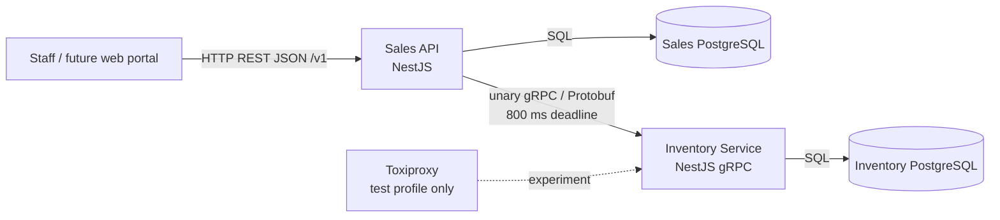

# RepuestosSur v1 - frozen architecture baseline

## Architecture



## Technology baseline

- Node.js 24 LTS.
- TypeScript.
- NestJS 12.x (pin exact versions in the lockfile; do not float during the assignment).
- Prisma ORM 7.x, not Prisma 8 RC.
- PostgreSQL 18.6.
- OpenAPI 3.1.2.
- Protocol Buffers `proto3` and gRPC using `@grpc/grpc-js`.
- Buf for protobuf lint/breaking checks.
- Docker Compose v2.
- Vitest for automated tests.
- k6 + Toxiproxy for the selected resilience experiment.

## Ownership boundaries

### Sales owns
- customers
- sales orders
- order items
- order lifecycle
- idempotency keys
- public authentication/authorization
- REST error semantics
- historical `sku`/`name` snapshots stored with order items

### Inventory owns
- parts
- SKU
- current available stock
- stock movement ledger
- atomic stock reservation/release

### Forbidden
- Sales reading/writing Inventory DB.
- Inventory reading/writing Sales DB.
- Shared business tables.
- A third generic shared business-service module.
- Directly exposing Inventory gRPC to the external client.

## Synchronous create-order flow

1. Validate API key (`operator`).
2. Validate JSON and `Idempotency-Key`.
3. Resolve/create idempotency record and stable UUID `order_id`.
4. Verify local customer exists.
5. Call `ReserveStock(order_id, items)` once.
6. Inventory validates every part and quantity, locks/updates stock atomically, records ledger entries, and returns part snapshots plus before/after stock.
7. Sales inserts the confirmed order and its item snapshots in its own transaction.
8. If step 7 fails, Sales calls `ReleaseStock(order_id)` as compensation.
9. Return HTTP 201 and `Location: /v1/orders/{orderId}`.

## Cancellation flow

1. Load order locally.
2. If already `CANCELLED`, return it with 200.
3. Call `ReleaseStock(order_id)`.
4. Only after success, update local order to `CANCELLED` with `cancelledAt`.
5. Return 200.

## Inventory transaction rules

`ReserveStock` is all-or-nothing across all order items. It must not decrement one part and then fail leaving partial mutations. Part IDs within an order are unique. Quantity is an integer from 1 to 999.

Inventory keeps a unique operation record by logical order ID. Repeating the exact same reservation returns the original result (`replayed=true`). Repeating a release returns the original release result. Attempting to reuse an existing order ID for a different reservation payload is a contract violation and must fail rather than mutate stock.

## Public order state machine

```text
      create + stock OK
              |
              v
         CONFIRMED
              |
           cancel
              v
         CANCELLED
```

No externally visible PENDING state exists in v1. A failed create request does not expose an order resource.

## Data rules

- IDs: UUID strings.
- Timestamps: UTC, RFC 3339 on REST; `google.protobuf.Timestamp` internally.
- Customer email is unique case-insensitively after normalization.
- Part SKU is unique in Inventory.
- Stock cannot be negative.
- `items` contains 1..50 unique part IDs.
- Customer name: 1..120 characters.
- Order quantity per item: 1..999.
- Lists use page/pageSize with default 1/20 and max 100 on REST.
- Inventory list returns the complete small academic inventory; pagination is intentionally omitted from gRPC v1.

## Scope explicitly deferred

- payments
- prices/taxes
- shipping
- user accounts
- event bus
- distributed transaction coordinator
- Kubernetes
- service mesh
- automatic gRPC retries
- circuit breaker
- Redis in the critical order path
- HATEOAS unless the team later chooses the bonus
- second-language gRPC client unless the team later chooses the bonus
