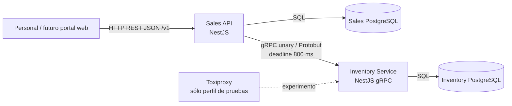

# RepuestosSur v1 - línea base de arquitectura congelada

## Arquitectura



## Línea base tecnológica

- Node.js 24 LTS.
- TypeScript.
- NestJS 12.x (fijar versiones exactas en el lockfile; no dejarlas flotando durante el encargo).
- Prisma ORM 7.x, no Prisma 8 RC.
- PostgreSQL 18.6.
- OpenAPI 3.1.2.
- Protocol Buffers `proto3` y gRPC usando `@grpc/grpc-js`.
- Buf para lint y verificación de cambios incompatibles de protobuf.
- Docker Compose v2.
- Vitest para pruebas automatizadas.
- k6 + Toxiproxy para el experimento de resiliencia seleccionado.

## Límites de responsabilidad

### Sales es responsable de
- clientes;
- órdenes de venta;
- items de órdenes;
- ciclo de vida de las órdenes;
- keys de idempotencia;
- autenticación y autorización públicas;
- semántica de errores REST;
- snapshots históricos de `sku`/`name` almacenados con los items de una orden.

### Inventory es responsable de
- piezas;
- SKU;
- stock disponible actual;
- registro de movimientos de stock;
- reserva y liberación atómicas de stock.

### Prohibido
- Que Sales lea o escriba la base de datos de Inventory.
- Que Inventory lea o escriba la base de datos de Sales.
- Tablas de negocio compartidas.
- Un tercer módulo genérico de servicio de negocio compartido.
- Exponer directamente Inventory gRPC al cliente externo.

## Flujo síncrono de creación de una orden

1. Validar la API key (`operator`).
2. Validar el JSON y `Idempotency-Key`.
3. Resolver o crear el registro de idempotencia y un UUID estable `order_id`.
4. Verificar que el cliente local exista.
5. Llamar una vez a `ReserveStock(order_id, items)`.
6. Inventory valida cada pieza y cantidad, bloquea/actualiza el stock de forma atómica, registra los movimientos y devuelve snapshots de las piezas junto con el stock antes/después.
7. Sales inserta la orden confirmada y los snapshots de sus items dentro de su propia transacción.
8. Si el paso 7 falla, Sales llama a `ReleaseStock(order_id)` como compensación.
9. Devolver HTTP 201 y `Location: /v1/orders/{orderId}`.

## Flujo de cancelación

1. Cargar la orden localmente.
2. Si ya está `CANCELLED`, devolverla con 200.
3. Llamar a `ReleaseStock(order_id)`.
4. Sólo después del éxito, actualizar la orden local a `CANCELLED` con `cancelledAt`.
5. Devolver 200.

## Reglas transaccionales de Inventory

`ReserveStock` es todo-o-nada para todos los items de una orden. No debe descontar una pieza y luego fallar dejando mutaciones parciales. Los IDs de piezas dentro de una orden son únicos. La cantidad es un entero entre 1 y 999.

Inventory mantiene un registro de operación único por ID lógico de orden. Repetir exactamente la misma reserva devuelve el resultado original (`replayed=true`). Repetir una liberación devuelve el resultado original de la liberación. Intentar reutilizar un ID de orden existente para un payload de reserva diferente constituye una violación del contrato y debe fallar sin mutar el stock.

## Máquina de estados pública de una orden

```text
      crear + stock OK
              |
              v
         CONFIRMED
              |
           cancelar
              v
         CANCELLED
```

No existe un estado PENDING visible externamente en v1. Una solicitud de creación fallida no expone un recurso de orden.

## Reglas de datos

- IDs: strings UUID.
- Timestamps: UTC, RFC 3339 en REST; `google.protobuf.Timestamp` internamente.
- El email de cliente es único sin distinguir mayúsculas/minúsculas después de normalizarlo.
- El SKU de una pieza es único en Inventory.
- El stock no puede ser negativo.
- `items` contiene entre 1 y 50 IDs de piezas únicos.
- Nombre del cliente: entre 1 y 120 caracteres.
- Cantidad por item de orden: entre 1 y 999.
- Los listados REST usan `page`/`pageSize`, con valores predeterminados 1/20 y máximo 100.
- El listado de Inventory devuelve el inventario académico completo, de tamaño pequeño; la paginación se omite intencionalmente en gRPC v1.

## Alcance explícitamente diferido

- pagos;
- precios/impuestos;
- despacho;
- cuentas de usuario;
- event bus;
- coordinador de transacciones distribuidas;
- Kubernetes;
- service mesh;
- retries automáticos de gRPC;
- circuit breaker;
- Redis en la ruta crítica de creación de órdenes;
- HATEOAS, salvo que posteriormente se elija la bonificación;
- segundo cliente gRPC en otro lenguaje, salvo que posteriormente se elija la bonificación.
