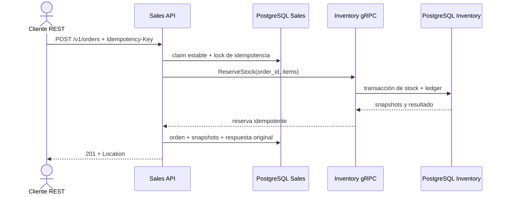

# RS-403 · Evidencia técnica, resiliencia y demo

Material para el informe y la defensa. Resultados medidos en `experiments/timeout/results/summary.csv`; método y datos por corrida en [`experiments/timeout/README.md`](../../experiments/timeout/README.md). No modifica los contratos congelados.

## Arquitectura final

Sales es un servicio NestJS/REST con PostgreSQL propio. Valida `X-API-Key` por rol, persiste clientes, órdenes y respuestas de idempotencia. `InventoryGateway` separa la lógica de órdenes del transporte; su implementación gRPC es el único acceso de Sales a Inventory. Inventory conserva su propia base PostgreSQL y el ledger idempotente de reservas/liberaciones. Toxiproxy sólo interviene en los escenarios de prueba y experimento.



La separación de datos, los contratos y el deadline se describen en [SYSTEM-DESIGN](../architecture/SYSTEM-DESIGN.md), [DATA-OWNERSHIP](../architecture/DATA-OWNERSHIP.md) y [ADR-004](../adr/ADR-004-resilience.md).

## Evidencia del modo de falla

| Condición | Respuesta pública | Efecto local y recuperación |
|---|---|---|
| Stock insuficiente | 409 `INSUFFICIENT_STOCK` | No queda una orden `CONFIRMED`; Inventory no descuenta parcialmente. |
| Inventory no disponible | 503 `INVENTORY_UNAVAILABLE` | No hay retry gRPC automático. |
| RPC de Inventory excede 800 ms | 504 `INVENTORY_TIMEOUT` | La orden no se confirma localmente. La reserva remota puede ser ambigua; reintentar con la misma key reutiliza `order_id` y no descuenta dos veces. |
| Reserva exitosa, escritura local fallida | 500 | Sales persiste `COMPENSATING` antes de liberar. La compensación y los retries de la misma key se serializan; una caída durante el release deja estado durable recuperable. |
| Commit local confirmado, ACK perdido | Se reproduce el resultado original | Sales vuelve a leer la key y no libera una reserva que ya pertenece a una orden confirmada. |
| Release de cancelación exitoso, actualización local fallida | 500 | La orden permanece `CONFIRMED`; el cliente repite cancelación. El release idempotente no repone stock dos veces y el retry completa `CANCELLED`. |

Pruebas black-box e integración PostgreSQL cubren 503/504, replay de key, respuesta original después de cancelar, ACK de commit perdido, serialización de compensación y retry de cancelación.

## Resultados del experimento RS-402

Entorno registrado: ejecución local con Docker Compose y `grafana/k6:0.57.0`, una sola máquina. Se ofrecieron 5 req/s durante 30 s por corrida, tras descartar 5 s de warm-up. Diseño: 2 deadlines × 6 latencias × 3 repeticiones = 36 corridas.

| Deadline | Latencia inyectada | Solicitudes | HTTP 201 | HTTP 504 | p95 mediano (ms) | máximo (ms) |
|---:|---:|---:|---:|---:|---:|---:|
| 800 ms | 0 | 451 | 451 | 0 | 28.47 | 40.37 |
| 800 ms | 250 | 452 | 452 | 0 | 287.30 | 295.44 |
| 800 ms | 500 | 453 | 453 | 0 | 514.90 | 539.04 |
| 800 ms | 750 | 451 | 451 | 0 | 779.70 | 792.37 |
| 800 ms | 1000 | 452 | 0 | 452 | 825.75 | 835.14 |
| 800 ms | 1500 | 453 | 0 | 453 | 820.90 | 836.00 |
| 60000 ms | 0 | 452 | 452 | 0 | 27.45 | 37.35 |
| 60000 ms | 250 | 452 | 452 | 0 | 283.36 | 292.55 |
| 60000 ms | 500 | 453 | 453 | 0 | 513.54 | 536.29 |
| 60000 ms | 750 | 451 | 451 | 0 | 763.33 | 780.37 |
| 60000 ms | 1000 | 453 | 453 | 0 | 1013.97 | 1027.59 |
| 60000 ms | 1500 | 452 | 452 | 0 | 1514.10 | 1536.30 |

Con el deadline de 800 ms hubo 2.712 solicitudes: 1.807 HTTP 201 y 905 HTTP 504; no se observaron 409, 503 ni otros códigos. Las latencias de 1.000 y 1.500 ms dieron 504 en todas las solicitudes. Con 60.000 ms, las 2.713 solicitudes fueron 201 y p95 siguió la latencia inyectada: 1.013,97 ms a 1.000 ms y 1.514,10 ms a 1.500 ms.

**Conclusión.** El deadline separó las condiciones de 750 y 1.000 ms y limitó la espera observada frente a la línea base. No es un límite duro de 800 ms para HTTP: el máximo medido fue 836 ms, pues el deadline se aplica al RPC y la respuesta HTTP añade el manejo del error y su recorrido. Los CSV/JSON crudos permiten regenerar tablas y gráficos sin transcribir métricas.

## Trade-offs y límites

- No hay retries gRPC automáticos. Las respuestas ambiguas requieren retry explícito del cliente con la misma `Idempotency-Key`; así no se oculta la falla ni se crea una segunda reserva.
- La compensación es durable e idempotente, no una transacción distribuida. No hay worker/outbox: si `COMPENSATING` no puede terminar, un retry del cliente es lo que la reanuda.
- La cancelación prioriza liberar stock antes de marcar `CANCELLED`. Si falla la escritura local tras el release, hay una ventana en que la orden continúa `CONFIRMED` aunque Inventory ya restituyó stock; repetir la cancelación converge sin doble restitución.
- El toxic de Toxiproxy añade retardo al stream TCP compartido por gRPC/HTTP/2; no equivale a una medición de red real.
- Todo corre en una máquina; el generador, los servicios y PostgreSQL comparten recursos. Cinco req/s evita saturar el pool predeterminado de diez conexiones, pero no mide capacidad.
- Tres repeticiones describen dispersión, no sustentan inferencia estadística ni intervalos de confianza. Docker Desktop/Windows no fue el entorno medido.

## Guion conciso de demo

Requisitos: Docker Compose, `curl`, `jq` y [`grpcurl`](https://github.com/fullstorydev/grpcurl#installation). Ejecutar desde la raíz. Si cambias las API keys del `.env`, exporta en la shell el mismo `API_KEY_OPERATOR`. Los valores de API key de ejemplo son sólo para desarrollo local.

### 1. Levantar el stack con Toxiproxy

```bash
INVENTORY_GRPC_URL=toxiproxy:50051 docker compose --profile experiment up -d --build --wait
bash experiments/timeout/scripts/toxic.sh ensure
export BASE_URL=http://localhost:3000
export OPERATOR_KEY="${API_KEY_OPERATOR:-local-operator-key-for-demo}"
export PART_ID=d6e1fd98-cb07-458f-aa12-6fe220b37604
curl -fsS "$BASE_URL/v1/health" | jq .
```

### 2. Crear cliente y capturar stock inicial

```bash
DEMO_TAG=$(date +%s)
CUSTOMER_ID=$(curl -fsS -X POST "$BASE_URL/v1/customers" \
  -H "X-API-Key: $OPERATOR_KEY" -H 'Content-Type: application/json' \
  -d "{\"name\":\"Demo $DEMO_TAG\",\"email\":\"demo-$DEMO_TAG@example.test\"}" | jq -r .id)

grpcurl -plaintext -import-path contracts/grpc/repuestossur/inventory/v1 \
  -proto inventory.proto -d "{\"part_id\":\"$PART_ID\"}" \
  localhost:50051 repuestossur.inventory.v1.InventoryService/GetPart | jq .part.stock_available
```

### 3. Crear, rechazar por falta de stock y cancelar

```bash
ORDER=$(curl -fsS -X POST "$BASE_URL/v1/orders" \
  -H "X-API-Key: $OPERATOR_KEY" -H 'Content-Type: application/json' \
  -H "Idempotency-Key: demo-order-$DEMO_TAG" \
  -d "{\"customerId\":\"$CUSTOMER_ID\",\"items\":[{\"partId\":\"$PART_ID\",\"quantity\":1}]}")
ORDER_ID=$(printf '%s' "$ORDER" | jq -r .id)
printf '%s\n' "$ORDER" | jq '{id,status,items}'

# Esperar HTTP 409 INSUFFICIENT_STOCK; el fixture tiene stock inicial cero.
curl -sS -i -X POST "$BASE_URL/v1/orders" \
  -H "X-API-Key: $OPERATOR_KEY" -H 'Content-Type: application/json' \
  -H "Idempotency-Key: demo-empty-$DEMO_TAG" \
  -d "{\"customerId\":\"$CUSTOMER_ID\",\"items\":[{\"partId\":\"74199389-6b4e-43f2-96b2-c2a4ab3959bc\",\"quantity\":1}]}"

curl -fsS -X POST "$BASE_URL/v1/orders/$ORDER_ID/cancel" -H "X-API-Key: $OPERATOR_KEY" | jq .status
# Repetir GetPart: stock_available vuelve al valor inicial.
grpcurl -plaintext -import-path contracts/grpc/repuestossur/inventory/v1 \
  -proto inventory.proto -d "{\"part_id\":\"$PART_ID\"}" \
  localhost:50051 repuestossur.inventory.v1.InventoryService/GetPart | jq .part.stock_available
```

### 4. Mostrar 503 y 504

```bash
# Inventory detenido: esperar HTTP 503 INVENTORY_UNAVAILABLE y luego recuperarlo.
docker compose stop inventory-grpc
curl -sS -i -X POST "$BASE_URL/v1/orders" -H "X-API-Key: $OPERATOR_KEY" \
  -H 'Content-Type: application/json' -H "Idempotency-Key: demo-down-$DEMO_TAG" \
  -d "{\"customerId\":\"$CUSTOMER_ID\",\"items\":[{\"partId\":\"$PART_ID\",\"quantity\":1}]}"
docker compose up -d --wait inventory-grpc

# Retardo > deadline: esperar HTTP 504 INVENTORY_TIMEOUT.
bash experiments/timeout/scripts/toxic.sh set 1000
curl -sS -i -X POST "$BASE_URL/v1/orders" -H "X-API-Key: $OPERATOR_KEY" \
  -H 'Content-Type: application/json' -H "Idempotency-Key: demo-timeout-$DEMO_TAG" \
  -d "{\"customerId\":\"$CUSTOMER_ID\",\"items\":[{\"partId\":\"$PART_ID\",\"quantity\":1}]}"
bash experiments/timeout/scripts/toxic.sh clear
# Repetir exactamente el mismo payload y key: esperar 201 y una sola reserva efectiva.
curl -fsS -X POST "$BASE_URL/v1/orders" -H "X-API-Key: $OPERATOR_KEY" \
  -H 'Content-Type: application/json' -H "Idempotency-Key: demo-timeout-$DEMO_TAG" \
  -d "{\"customerId\":\"$CUSTOMER_ID\",\"items\":[{\"partId\":\"$PART_ID\",\"quantity\":1}]}" | jq '{id,status}'
```

### 5. Presentar la evidencia del experimento

Abrir [`experiments/timeout/results/summary.csv`](../../experiments/timeout/results/summary.csv) para las 36 filas y [`experiments/timeout/README.md`](../../experiments/timeout/README.md) para la hipótesis, método, resultados y limitaciones. No extrapolar el resultado de una máquina a throughput de producción.
